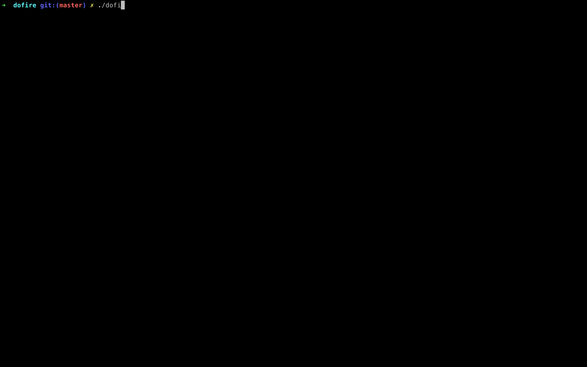

# dofire
A Digital Ocean firewall manager

dofire currently let's you add, remove and edit Digital Ocean firewall rules.

# Setup
1. `git clone https://github.com/ndangles/dofire`
2. `cd dofire`
3. `bundle` if you don't have [bundler](https://bundler.io/) it can be installed by running `gem install bundler`'
4. `cp ./dofire /usr/local/bin` Assuming you would like to call `dofire` from anywhere otherwise you can just run `./dofire` from within the repo

# Authentication
In order to interact with the Digital Ocean firewall, you will need to create a read/write [personal access token](https://cloud.digitalocean.com/account/api/tokens). dofire looks for access tokens in two places. It will first check the configuration file that is created from using the `doctl` command line tool so if you are already using `doctl` then you won't have to do anything. If you decide to install the `doctl` tool provided by Digital Ocean you can run `doctl auth init` to set it up with your access token. The other option is setting an environment variable called `DIGITALOCEAN_ACCESS_TOKEN`. You can add `export DIGITALOCEAN_ACCESS_TOKEN=your-personal-access-token` to your shell profile.

# Contributions
This code is awfully written, I don't usually code in Ruby but I wanted to use a Digital Ocean supported library for their API which was either ruby or go so code is written in more of a "hey this works" way. If I see people are interested in this tool outside of my own personal use case, I will gladly rewrite it the appropriate way. Also it would be nice to package this up eventually so it can be installed via Homebrew but again this was created quickly for a personal use case so unless there is significant interested it probably will stay as is. If you would like to see any other features or come across bugs, please open an issue on the repo. 
